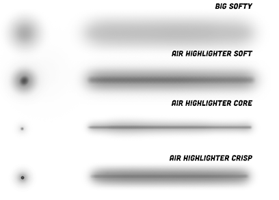
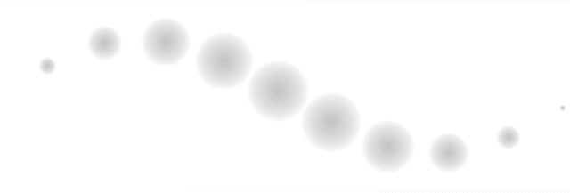
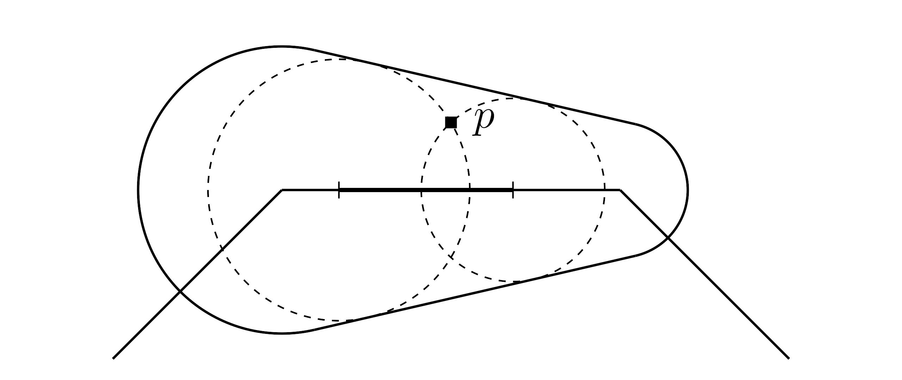

An airbrush stroke looks like a solid vanilla stroke.
The main difference is its transparency gradient from middle axis to rim.

Technologically, traditional airbrush is a special type of stamp brush whose footprint is a transparent dot.
When the footprints are very close and blend each other, they form an airbrush stroke with the transparency gradient, as the figure shows.
If you've learned the previous chapter, rendering an airbrush is nothing more than creating a transparent dot as footprint.

When artists draw illustrations or animations, airbrush has special usages like coloring, shading, or highlighting an illustration,
while other brushes are typically used for drawing outlines.

Therefore, airbrush strokes typically cover larger areas of pixels compared to outline strokes.
Optimizing airbrush rendering algorithms can significantly improve rendering performance.
In this tutorial, I will present a fancy and efficient way of rendering and explain the theory behind it.

## Theory

If we render airbrush strokes as a regular stamp strokes, stamp interval should be extremely small, as shown in the above GIF images.
A pixel on the stroke samples the footprint more than 30 times at maximum, which can significantly impact rendering performance.
To address the issue, we can model this process using calculus, and derive a mathematically continuous stroke.

Imagine there are infinite number of stamps on an edge whose length is $L$.
The number of stamps is denoted with $n$, and the interval between stamps is $\Delta L = L/n$.
We continue the idea of "articulated", calculate edges individually and blend them together.
For each pixel whose position is $\pmb p$ invoked by the edge,
its alpha value $\Alpha(\pmb p)$ is equal to blend all the alpha values $\Alpha_s(\pmb p_i)$ from all the stamps on the edge.
The $\pmb{p_i}$ is the vector from stamp $i$ and the current pixel.

$$
\Alpha(\pmb p) = 1-\prod_{i=1}^n \left(1-\Alpha_s(\pmb p_i)\right)
$$

We define "alpha density" value, denoted with small alpha $\alpha$.
Let $\Alpha_s(\pmb p_i) = \alpha_s(\pmb p_i) \Delta L$, $\alpha_s(\pmb p_i)$ is called alpha density field and defined by the footprint.
Hopefully, the notations remind you of the probability density and probability values
(or uniformly distributed charge on a bar, and we are integrating its electric field).

Replace the $\Alpha_s(\pmb p_i)$ and we get:

$$
\Alpha(\pmb p) = 1-\prod_{i=1}^n (1-\alpha_s(\pmb p_i) \Delta L)
$$

So, given any $\alpha_s(\pmb p_i)$ function,
we can calculate the stamp strokes' continuous form by substituting the function into the formula.

We reuse the old local coordinate, originating at $p_0$, and X and Y axes align to the tangent and normal direction.
So, $\pmb p = (x, y)$ and $\pmb p_i = (x - l_i, y)$ in the coordinate.
The $l_i$ is the X position of stamp i.
As $n\rightarrow \infty$ and $\Delta L \rightarrow 0$, and apply [product integral](https://en.wikipedia.org/wiki/Product_integral) (Volterra Integral) on the formula.

$$
\Alpha(x, y) = 1 - \exp\left(-\int_0^L \alpha_s(x - l, y) dl \right)
$$

If you know the Minkowski sum, it feels like that we are calculating Minkowski sum of a dot and a polyline.
But the dot is transparent, and we need to know the alpha value associated with each vector in the final vector set.

## Special Alpha Density
To get a clearer comprehension of the theory, let's examine a special case.
Consider the alpha density value is a constant,
indicating that a stamp stroke's footprint is a consistently transparent dot, defined by the function
$$
\alpha_s(d) =
\begin{cases}
\alpha_c & d \le R \\
0 & d > R
\end{cases}
$$

where $\alpha_c$ is the constant alpha value within the radius $R$,
and $d$ is the distance to dot's center.

Substituting the $\alpha_s(d)$ into the $\Alpha(x, y)$ allows us to partition the integral into two parts based on the value of $d$:
$$
\Alpha(x, y) = 1 - \exp\left(-\int_{d \le R} \alpha_c dl -\int_{d > R} 0 dl \right)
$$

The second integral does not contribute to the expression and can be omitted for simplicity.
The first integral $\int_{d \le R}$ represents the integral over the segment of the edge that stamps can cover the current pixel.
The segment is marked with thick solid line in the figure below.

The figure is exactly the same as the one when learning stamp strokes.
We denote the segment's length as $L_r$, then the integral simplifies to a multiplication:
$$
\Alpha(x, y) = 1 - \exp\left(-\alpha_c L_r \right)
$$

In practice, the segment's length $L_r$ can be calculated with the two roots of the equation.
We have already learned it when rendering stamp stroke, and we will reuse that part of code.
Here is the implementation:

import StampRound from "./StampRound";

<StampRound showEditor={[false, false, true]}/>

As I mentioned above, airbrush's most important characteristic is its transparency gradient.
Let's derive this gradient function.
For simplicity, we assume stroke radius is a constant value $R$.
It's not hard to deduce that $L_r(y) = 2\sqrt{R^2 - y^2}$ in the bone area.
After substitution,
$$
\Alpha(y) = 1 - \exp\left(-2\alpha_c \sqrt{R^2 - y^2} \right)
$$
So, the alpha value of a pixel in the bone area is independent of its x position.
This independence applies to any other footprints or alpha density fields as long as they are constrained within a dot.
Additionally, pixels in the bone area with the same y position always integral over the same length of a segment, therefore they have the same alpha value.