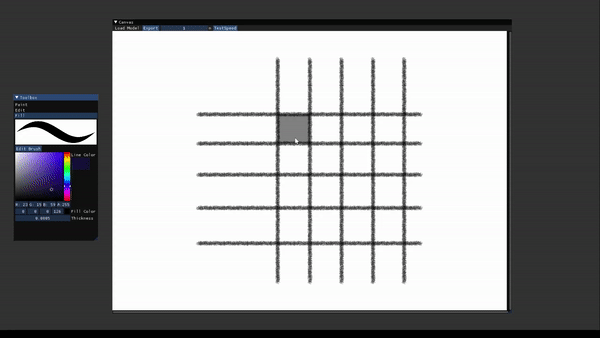
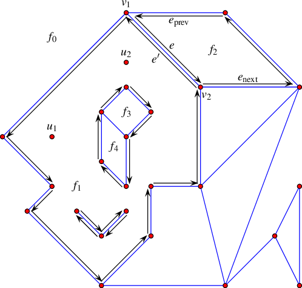

You may have learned how to render brush strokes on polyline curves.
If you want to develop a basic paint program like what I did, the next logical step is to learn how to fill color.

_Vector fill demo_

We've found that filling color is precisely the _2D Arrangement_ and _Point Location_ problem in computational geometry (plus rendering a polygon).
Basically all textbooks about computational geometry cover these problems and the corresponding algorithms to solve them.
It's very straightforward how to apply once you've learned about them.
But before you delve into the intricate details in a textbook, I will offer a brief overview to provide a general understanding.

We are given a set of 2D polylines (our vector drawings) and a query point,
the problem is to find the region enclosed by polylines and contains the query point.
To achieve this, we need first construct a 2D arrangement object whose official definition is:
A subdivision of the plane induced by the curves into vertices, edges, and faces,
which is typically stored in a doubly-connected edge list (DCEL) data structure.

Hopefully, it sounds familiar and reminds you of the data structure to store a 3D mesh.
In fact, a naive 2D arrangement is nothing more than a 2D polygon mesh (or meshes).
And to locate a query point, a native solution is to iterate through all faces from the mesh and test if the query point is inside.

From an introductory-level textbook, you will learn how to construct a polygon mesh (the arrangement object) from line segments and
algorithms to locate a point better than the naive solution.
To dive deeper, you may try using the [CGAL 2D arrangement library](https://doc.cgal.org/latest/Arrangement_on_surface_2/index.html)
and learn the arrangement constructed from 2D polylines, which is slightly different with a naive polygon mesh.

I hope this "2D mesh metaphor" will help you better understand the problems.
