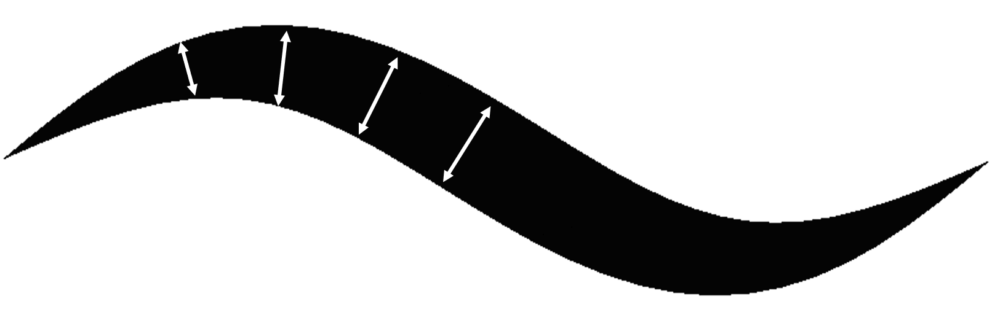

## Brush strokes

_Open-source [brush presets by Raghavendra](https://gitlab.com/raghukamath/krita-brush-presets) in Krita._

In graphics design software such as Photoshop and Krita, you can use a wide range of brushes within the paint tool.
Learning how to render these stylized strokes with GPU is valuable.
Even if stylized strokes don't interest you,
this tutorial will provide methods to render a simple solid curve with GPU, which is useful when drawing UIs or debugging your 3D scene.

Over thousands of brushes are available online, which can be overwhelming to explore.
But more than 90% of the brushes are designed under the "stamp" model, and we call them "stamp brushes".
In the upcoming Stamp section, I will introduce the stamp model and how to implement it in a shader program.
Before that, I will introduce the basic solid stroke called "vanilla".
Vanilla and stamp share the exact same vertex placement methods, but the vanilla stroke is easier to implement.

While you may recognize a brush stroke by its stylization, another crucial property could be ignored: the "variable radius" along the stroke.
(I also ignored it in my paper.)
The radii are typically generated from the pressure values as a stylus presses and moves on a tablet.
For experienced artists, after installing a new painting program, one of the highest priorities is to configure the mapping function from pen pressure to brush radius.

  
In case you don't know about tablets and styluses

Digital artists paint with dedicated input devices: Tablet and Stylus.
If you're unfamiliar with tablets and styluses, you can watch the video below for more information:

_Variable radius along a stroke._

## Geometric data

To store the variable radius in brush stroke, we will render a unique type of vector curve:
An ordered list of points (polyline) with radius values assigned to each point.
As a user presses a stylus on a tablet and moves, a paint program generates a sequence of points to record the trace of movement.
Meanwhile, the pen pressure is transformed into the radius value assigned to each point.
After rendering the stroke on the polyline, the user feels like drawing on canvas.

_The monkey Suzanne in Blender (Grease Pencil), the orange dots on the right side show polylines' points (vertices)._

We can approximate any type of curve by increasing the number of points in a polyline, whether freehand-drawn or mathematically defined.
Try to change the `maxRadius` and `segmentCount` values in the code editor below to see how the vanilla stroke changes.
I will elaborate on how to render this stroke in the next section.
Feel free to change any other parts of the code as long as the function returns the `position` and `radius` array correctly.

import { ArticulatedLine2D } from "@site/src/components/ArticulatedLine2D";

<ArticulatedLine2D showEditor={[true, false, false]} />

Blender Grease Pencil team has developed a lot of novel tools to edit this polyline with radius representation.
Remember to check out if you were a researcher and want to develop novel techniques for digital painting.