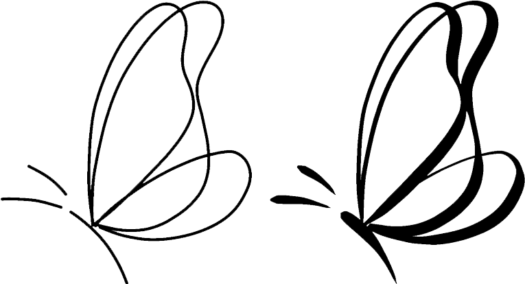
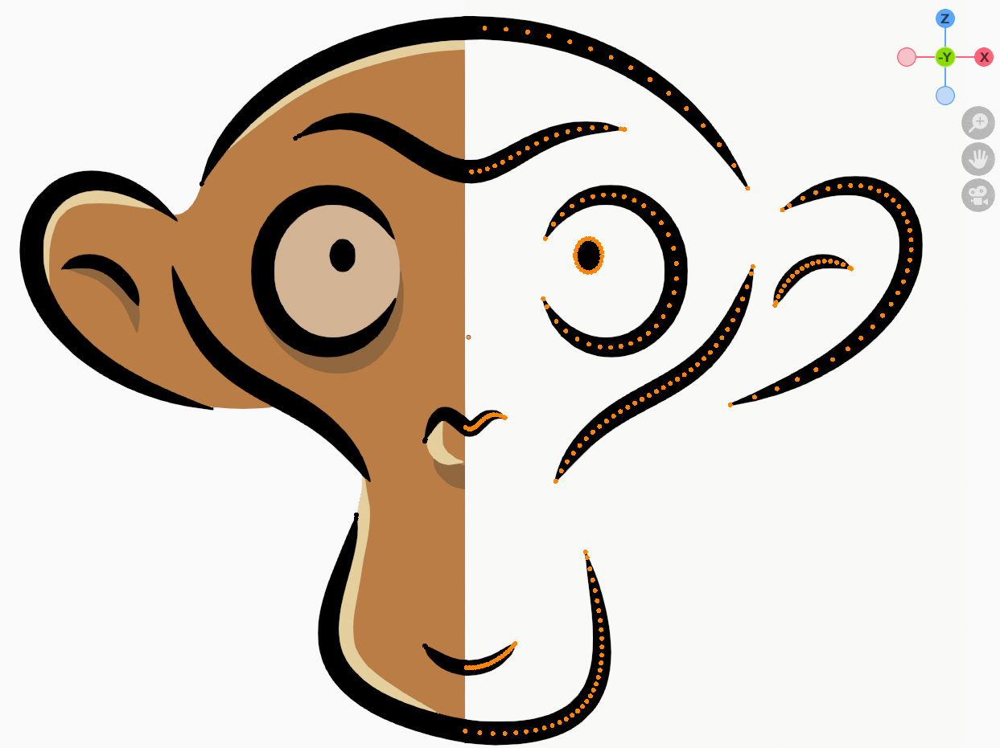

## Brush strokes

<figcaption>
Open-source [brush presets by Raghavendra](https://gitlab.com/raghukamath/krita-brush-presets) in Krita.
</figcaption>

In graphics design software such as Photoshop and Krita, you can use a wide range of brushes within the paint tool.
Learning how to render these stylized strokes with GPU is valuable.
However, there are over thousands of brushes available in Photoshop, which can be overwhelming to explore.
Luckily, more than 90% of the brushes are designed under the "stamp model", and we call them "stamp brushes".

In the upcoming sections, I will introduce the basic solid stroke called "vanilla" first,
then the stamp model and how to implement it in a shader program.
The vanilla and stamp strokes share the exact same vertex placement method.
For your better understanding, avoid jumping right into the stamp part.

Maybe the stamp strokes with various styles don't interest you, feel free to ignore it and learn the vanilla stroke only.
Knowing how to render a line is very handy when drawing UIs or debugging your 3D scenes.

While you may recognize a brush stroke by its stylization, another crucial property could be ignored:
the "variable width" along the stroke.
The property is critical for experienced artists drawing professional illustrations or animations.
For instance, you can tell the significant difference from the figure below.
The one with variable width on the right has more expressive appearance.

<figcaption>
    Butterfly by [Qianxi Liu](https://qianxi-folio.vercel.app/index.html).
</figcaption>

The width values are typically generated from the pressure values as a stylus presses and moves on a tablet.
After the artists install a new painting program,
one of the highest priorities is to configure the mapping function from pen pressure to brush radius.

  
In case you don't know about tablets and styluses

Digital artists paint with dedicated devices: Tablet and Stylus.
If you're unfamiliar with tablets and styluses, you can watch the video below for more information:

## Geometric data

To store the variable radius in brush stroke, we will render an uncommon type of vector curve:
An ordered list of points (polyline) with radius values assigned to each point.
As a user presses a stylus on a tablet and moves, a paint program generates a sequence of points to record the trace of movement.
Meanwhile, the pen pressure is transformed into the radius value assigned to each point.
After rendering the stroke on the polyline, the user feels like drawing on canvas.

<figcaption>
The monkey Suzanne in Blender (Grease Pencil), the orange dots on the right side show polylines' points (vertices).
</figcaption>

We can approximate any type of curve by increasing the number of points in a polyline, whether freehand-drawn or mathematically defined.
Try to change the `maxRadius` and `segmentCount` values in the code editor below to see how the vanilla stroke changes.
I will elaborate on how to render this stroke in the next section.
Feel free to change any other parts of the code as long as the function returns the `position` and `radius` array correctly.

import { ArticulatedLine2D } from "@site/src/components/ArticulatedLine2D";

<ArticulatedLine2D showEditor={[true, false, false]} />

Blender Grease Pencil team has developed many novel tools to edit polylines.
I recommend that everyone researching digital painting techniques learn about them.
https://www.youtube.com/watch?v=nZyB30-xZFs