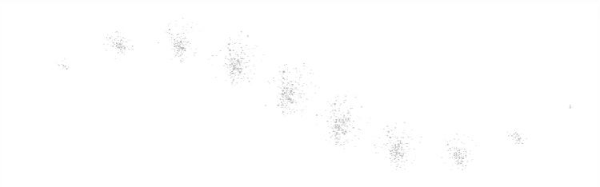
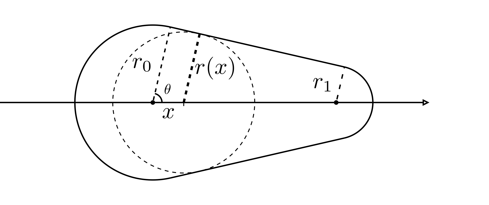

## Intro

The basic stamp stroke rendering is pretty intuitive.
We are given a texture called stamp texture or footprint.
While a user paints on a canvas, we render the texture onto the canvas equidistantly along the drawing trace.
When the textures are close enough, they seem continuous and form a stroke.

Artists love to create stamp brushes since their expressiveness and intuition.
More than 90% of brushes in popular paint software are stamp brushes.
Researchers and developers have developed dozens of extra parameters
that can apply various aspects of stylization on a stroke.
How to replicate these parameters with GPU acceleration is under-researched.
Therefore, we will focus on the most critical technique, how to place the stamp textures in a shader program.

A naive solution is to place a stamp texture at each vertex.

_Place a dot texture at each vertex._

But it's not good enough for the most usages.
The rendering result of strokes depends on polylines' vertex density.
After subdivision, simplification, or deformation of the polylines, the strokes get denser or sparser appearance, which ruins the rendering result.
We must develop methods that rendering is independent of vertex density, just like rendering 3D meshes.
Therefore, I will introduce you how to place stamp textures equidistantly along a polyline.

## Locate stamps

When rendering with CPU, calculating where to place stamp (stamp position) on a polyline is pretty straightforward.
Start from the very first vertex of the polyline, loop and move an interval at a time
until reach the end of polyline.
Implementing the process is trivial for experienced developers.

Implementation with a GPU graphics api is more challenging, but still relatively straightforward.
We use the same approach as rendering a vanilla stroke:
Placing the four new vertices for each edge.
The difference only comes to the fragment shader in practice.

We will calculate the stamp positions in the fragment shader.
At each polyline vertex, we compute its distance to the first vertex along the polyline.
The distances represent the cumulative length of the edges, and we calculated them with Prefix Sum algorithm.

  
 Parallel prefix sum 

  There are parallel prefix sum algorithms can be implemented with compute shaders,
  [wiki](https://en.wikipedia.org/wiki/Prefix_sum#Parallel_algorithms).
  By using one of them, the whole rendering process is GPU-accelerated.

  The best tutorial about parallel prefix sum I've ever found is this free course
  [High Performance Computing](https://www.udacity.com/course/high-performance-computing--ud281) by Prof. Rich Vuduc.
  The course introduces prefix sum in Lesson 6.

Since we place stamps equidistantly, we can calculate these positions in all pixels involved in each edge.
Then a pixel can loop through the positions, sample the stamp textures and determine its color.
We compute the texture coordinate with the pixel's distance to the stamp positions and radii.

## Loop and sample stamps

A pixel can loop through all stamps on the edge invokes it.
But the edge can be very long and has many unnecessary stamps for a pixel to loop through.
We want to constrain the loop within only a segment of the edge, within which stamps can cover the current pixel.
Given the pixel $p$, we can get this segment by solving the geometry shown in the figure below.

I label the segment can cover the pixel $p$ with the thicker black line.
The two dashed circles intersect at $p$.
I label their centers with vertical line ticks, which are the start and end points of the segment.
The centers are the farthest points where a stamp placed can cover the pixel $p$.
Any stamps outside the segment have no chance to affect the pixel's color.

In order to get start and end points' positions, we have a geometry puzzle to solve:

As the figure shows, we set up the same local coordinate as vanilla stroke in the shader program.
$p_0$ as the origin and X and Y axes align to the tangent and normal direction,
$(x_p, y_p)$ as the pixel's local coordinate.
$x$ is the furthest point's x value.
By solving it, we know the position of farthest point.
The distance from the pixel and the furthest point $r(x)$ is the radius of the furthest point, whose value is determined by x.`
To solve the unknown $x$, we can set an equation from the dashed right triangle $r(x)^2 = (x_p - x)^2 + y_p^2$.

It's not hard to derive $r(x) = r_1 * x/l + r_0 * (1-x/l)$ from the figure below.
$l$ is the length of current edge.

By replacing $r(x)$, we get a quadratic equation $ax^2 + bx + c = 0$:

$a = 1 - \cos^2\theta$;
$b = 2 * (r_0 * \cos\theta - x_p)$;
$c = x_p^2 + y_p^2 - r_0^2$

Remind that $\cos\theta = (r_0 - r_1)/l$.
Applying the formula for solving quadratic equations,
two roots of the equation are the X value of min and max points of the segment.

Therefore, pixels in the fragment shader only loop through stamps that can cover it.
You can use RGBA values sampled from stamp textures directly.
But for the most common scenario,
we set RGB values with users' brush setting and sample alpha values from a monochrome stamp texture,
whose pixel's gray scale determines the opacity.

todo: code and canvas

## Square stamp texture
I introduce the brush rendering with the assumption that stamp textures are constrained within a dot area,
which is the most common case in practice.
But it's not for all, area outside the dot plays a critical role sometimes.
There is a tricky approach to rendering the whole square and improving rendering performance,
but break the "correctness" of geometry.

We place vertices a little bit differently from before.
Instead of offset vertices by $r_i\tan\frac{\theta}{2}$ along the normal direction, we

