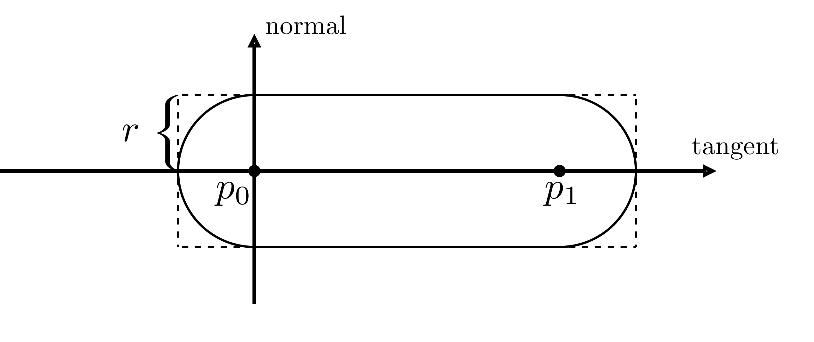
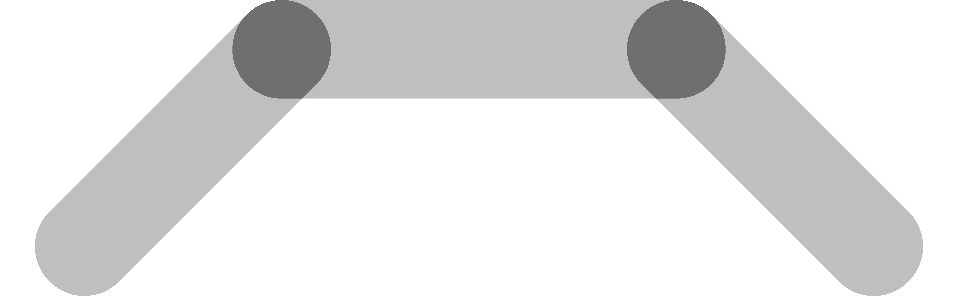
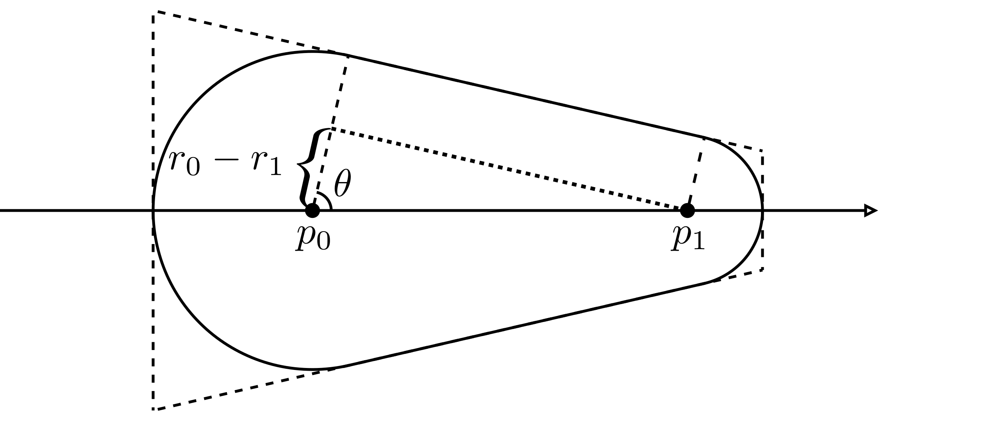
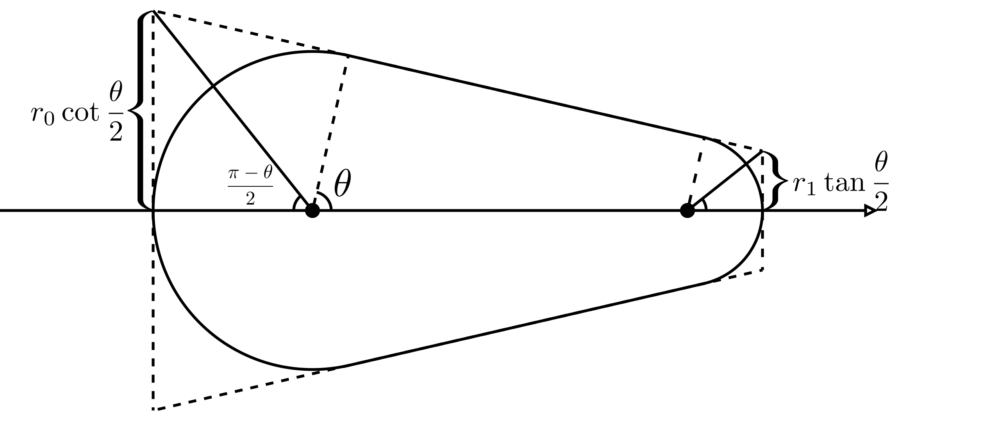
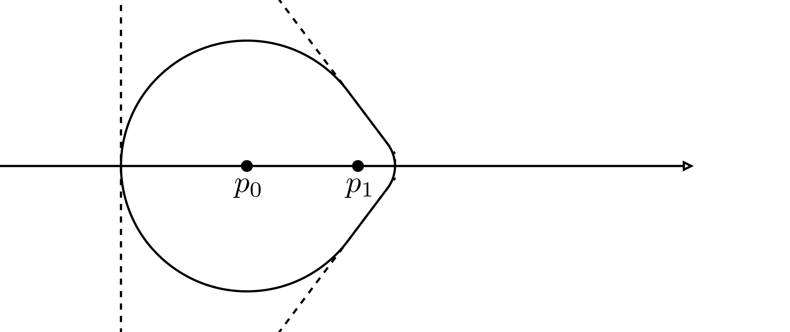
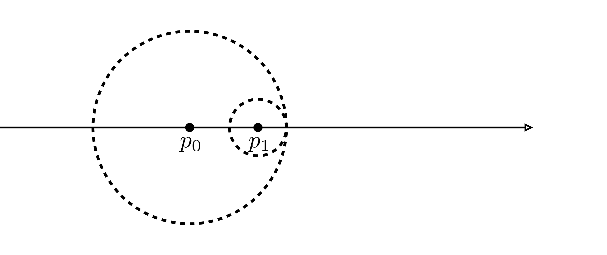

## Uni radius

Let's start with a solid stroke with a single radius value.
Later, add variable radius to it.

import Uniradius from "./uni";

<Uniradius />

We are given a polyline with a set of vertices.
In the diagram below, we select an edge with two consecutive vertices, labeled as $v_i$ and $v_{i+1}$, then draw a capsule on it.
If we render every single edge like this, edges will connect to each other naturally, as shown on the right.

|   |  |
| :-------------------------: | :------------------------: |
| _Draw a capsule on an edge_ |    _Connected capsules_    |

The diagram quite looks like drawing an [articulated arm](https://www.google.com/search?q=articulated+arm+2D+diagram&tbm=isch).
Therefore, we call it **articulated** stroke (Line) rendering.

Hopefully, the above idea sounds straightforward to you.
It's also easy to implement with GPU APIs.
To draw the capsule, we generate four new vertices to invoke a rectangle, as shown in the left figure below.
Then, discard the pixels in the four corners, as shown on the right. All is done!

|         |  |
| :----------------------------: | :-----------------------------: |
| _Generate rectangle vertices_ |        _Discard corners_        |

There are several possible ways to generate the rectangle vertices.
The most elegant one is to use a geometry shader.
But sadly, it's not supported on Apple's ecosystem and web platform, and many readers are not experienced in it.
So, I will mainly introduce another implementation with instanced rendering.
But if you're familiar with geometry shader, check out the dropdown tab below.

<details>
  <summary>Geometry shader implementation</summary>

Geometry shader is designed for transforming geometry.
We can write very elegant code on the CPU side, which feels like an OpenGL built-in stroke (line strip) rendering functionality.

```cpp
glUseProgram(brushStrokeProgram)
/* set uniforms ... */
glBindVertexArray(vao);
glDrawArrays(GL_LINE_STRIP, ...);
```

Pseudo code in the geometry shader:

```glsl
layout(lines) in;
layout(triangle_strip, max_vertices = 4) out;

void main(){
  /* Set the down left vertex variables */
  EmitVertex();
  /* Set the up left vertex variables */
  EmitVertex();
  /* Set the down right vertex variables */
  EmitVertex();
  /* Set the up right vertex variables */
  EmitVertex();
}
```

You will find the details in the upcoming description.

#### Geometry shader implementation is elegant

The vertex array buffer object `vao` is created like drawing a line strip.
We bind it and draw it as a line strip, then get a custom "line strip"!
Every line of the code is incredibly descriptive and self-explanatory.
When mocking geometry shader's behavior with instanced rendering, the code gets obscure.
Sadly, graphics engineers cannot easily enjoy this elegance because of Apple's Metal API.

You may argue that geometry shader can cause a lot of performance issues.
But benefiting from hard work by GPU engineers and manufacturers,
the computational power is very much superfluous to draw 2D contents with a modern discrete graphics card.
Performance is not everything.
Writing maintainable and easy-to-understand code is much more critical in some cases.

</details>

We use instanced rendering to draw a large number of objects with the same vertex data.
For drawing a stroke, each instance is the rectangle shown above, and the number of instances is the number of stroke's edges
(number of polyline vertices minus one).
To place a rectangle, all rectangle's vertices need to know the positions of polyline vertices $p_0$ and $p_1$ and radius value $r$.
We will set a local coordinate in the shader program, origin at $p_0$, X and Y axes align to the tangent and normal direction:


You will find implementation details in the comments of the shader code below.
The "vertex.glsl" for the vertex shader and "fragment.glsl" for the fragment shader, feel free to change them:

<Uniradius showEditor={[false, true, true]} />

<details>
<summary>
In case you don't know the `flat` qualifier
</summary>

Shader variables are interpolated by default when passing to a fragment shader.
The `flat` qualifier tells your shader program no to interpolate the variable.
If you still need clarifications, check out this [article](https://www.geeks3d.com/20130514/opengl-interpolation-qualifiers-glsl-tutorial/).

</details>

## Opacity



Obviously, we are not dealing with transparency correctly in image above.
You can replicate it by setting the `color` variable in the fragment shader above as `const vec4 color = vec4(0.0, 0.0, 0.0, 0.5);`.
The areas where two edges connect are doubly colored.
We need to fix it.

For clarification, we define "joint" areas in the two circles at the start and end of the capsule,
and the non-joint area is called "bone" area.


Joint areas are doubly colored.
We need to adjust joints' pixels opacity (alpha value) to get the target opacity of bone.
Label joint alpha $\Alpha_j$ and bone alpha $\Alpha_b$.
Since rgb values from previous and next edge are the same, we can apply alpha compositing formula:
$\Alpha_b = \Alpha_j + \Alpha_j * (1 - \Alpha_j)$, and solve and joint opacity
$$
\Alpha_j = 1 - \sqrt{1 - \Alpha_b}
$$
Let's see how to implement it:

<details>
  <summary>About alpha compositing</summary>

I've seen very experienced graphics engineers unfamiliar with alpha compositing.
I would recommend two articles [1](https://ciechanow.ski/alpha-compositing/) and [2](https://wiki.edunitas.com/IT/en/114-10/alpha-channels_400_eduNitas.html).
The topic is so important for 2D rendering that I will write a dedicated article to explain when introducing the airbrush.

</details>

import Opacity from "./opacity";

<Opacity showEditor={[false, false, true]} />

## Variable radius

We are given a polyline with a radius value at each point to represent the variable radius stroke.
The rendering process is basically the same as uni-radius stroke:
Place four new vertices and discard the four corners, as shown in the figure below.

|  |  |
| :------------------------: | :------------------------: |
|         _An edge_          |     _Connected edges_      |

The new vertices form a trapezoid rather than a rectangle to cover the whole capsule.
We need to solve a few extra geometric parameters in this trapezoid.
First solve the angle $\theta$ in the diagrams.
As the figure below shows, draw a perpendicular from $p_1$ to the radius at $p_0$.
The distance between $p_0$ and $p_1$ is known.
$$
\cos\theta = \frac{r_0 - r_1}{||p_0 - p_1||}
$$



The line between trapezoid corners and polyline points are bisectors, drawn in solid black line,
so the corners' offset along the normal direction can be calculated.
You can easily know the parameters in the lower half part with symmetry.



Shader code implementation:

import Varradius from "./Var";

<Varradius showEditor={[false, true, true]} />

## Corner case

In the vertex shader, we discard edges in the two corner conditions.
But in fact, they represent one corner case, as shown in the figures below.



```glsl
// Corner case: The small circle is very close to the big one, casuing large offset in the normal direction, discard the edge
    if(normalTanValue > 10.0 || normalTanValue < 0.1) return;
```

When the small circle is very close to the big one, we get a large `normalTanValue` value and invoked triangles will cover large areas of pixels,
It can hurt the performance badly.



```glsl
// Coner case: One circle is entirely inside the another, discard the edge.
    if(abs(cosTheta) >= 1.0) return;
```

When the small circle gets closer and entirely inside the big one, how to place vertices is undefined.

The two `if` conditions happened in the same situation: the radius changes drastically in a short distance between points.
It rarely happens for the geometry data comes from a 2D canvas.
Modern tablets are stable enough to avoid generating this ill data.
But it is common in 3D, I will introduce the solution together with 3D stroke rendering.
