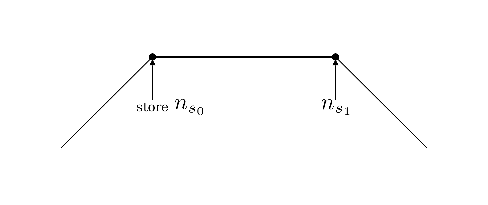

:::warning

This content is not peer-reviewed. Learn it under your own risk!

<details>
<summary>I'm kidding!</summary>

There’s no risk in learning something incorrectly.
I'm 100% sure that all the theory and code are correct.

The only risk is that I might change the terminology or math symbols to use.
Hopefully this won't confuse you in the future.
</details>

<figcaption>

© 2024 Shen Ciao. All rights reserved on this webpage (until Shen publishes the paper).

Unauthorized use and/or duplication of this material without express and written permission from this site’s author and/or owner is strictly prohibited.
Excerpts and links may be used, provided that full and clear credit is given to Shen Ciao with appropriate and specific direction to the original content.

</figcaption>

:::

## Interval patterns

### Fixed interval
In the [Stamp](../Basics/Stamp) section, we learned stamp brush and methods to render it.
We assumed the interval between stamp is a fixed value along a stroke.

> While a user paints on a canvas, we render the texture onto the canvas **equidistantly** along the drawing trace.
> When the textures are close enough, they seem continuous and form a stroke.

But this "fixed interval" pattern is not always the case in practice and may cause a potential rendering problem.
Let's take a look at this problem.

Assume we draw two strokes on a canvas.
The first is a stamp stroke with dot footprint, and the second is a basic solid stroke, as the figure below shows.
I want to copy the first stroke's brush and apply the brush to the second stroke.


You may notice the resulting stroke has denser dots and appearance.
This is because the interval between stamps in the first stroke is equal to the radius of each dot.
In contrast, the interval in the resulting stroke is smaller than its radius.
So, the result stroke's dots are aligned more densely than those in the first stroke.
This is unintuitive since artists expect the concept of "brush" controls the stroke appearance.
Copying and pasting a brush imply the source and target stroke have the same appearance.

Expect for copying brush, the issue also happens when resizing a stroke.
For example, imagine a case that we export vector drawings from a paint program to a game engine.
When rendering the drawings,
the game engine may need to scale the strokes' position and radius to translate them from local space to world space.
Unluckily, a careless programmer like me forgets to scale the stamp interval accordingly.
In the worst case, nothing shows the canvas and I would spend a whole day to debug it.

To avoid the issue, we rarely use a fixed length value as a brush parameter for artist to adjust.
Instead, we make the stamp interval be proportional to the stroke radius,
and use their ratio as the brush parameter.
Here, I call this value **interval ratio**, and denote it with the symbol $\eta$.
$$
\eta \vcentcolon= \frac{\mathrm{Interval}}{\mathrm{Radius}}
$$
For a paint program on the market like Krita, you can definitely find this parameter in its brush editor.
The parameter might be half of the value as defined in our system, because the program uses width value rather than radius value.
We will use radius here for the convenience of mathematical derivation.


<figcaption>
  Brush editor in Krita.
</figcaption>


<figcaption>
  Draw two strokes with different brush size in Krita.
</figcaption>

The "spacing: 1.0" means the stamp interval is the stroke width, or 2x radius.
So the footprints connect to each other in a row, even though the stroke radius is changed.

To implement this feature with our GPU rendering method, I would set the interval ratio as a uniform in shader.
It is pretty straightforward as the pseudocode below shows.

```glsl
// Get the `interval_ratio` value instead of `interval` from CPU.
uniform float interval_ratio;
float interval = interval_ratio * radius; // The stroke without variable width has only one radius value.
// Everything else remains the same......
```

However, things get tricky when rendering variable-width strokes.
With varying radius values, which one should be used to calculate the interval?
Perhaps the maximum radius of a stroke?
It's a reasonable compromise.
I did it in Ciallo's paper when conducting performance tests (and it seems I forgot about mentioning it).
A perfect choice is to use a user-specified stroke size when painting, as shown in the figure above of Krita.
But outside a paint program, it's not easy to get a user-specified radius value.
A once-and-for-all solution is to let the stamp interval vary along with the stroke radius.

### Proportional interval

We will learn how to render a "Proportional interval" stroke shown in the figure below.
Its interval is not fixed but vary along with the stroke radius.
Meanwhile, the interval is always proportional to the radius.


<figcaption>
  Proportional interval stamp stroke.
</figcaption>


<figcaption>
  Fixed interval stamp stroke.
</figcaption>

You might be confused by the statement "always proportional to the radius."
Though it's intuitively correct as the animation below shows.
I'll soon explain it with precise mathematical formulas, so don't worry about it too much for now.


<figcaption>
  Proportional interval animation by reducing the interval ratio $\eta$.
</figcaption>

Proportional interval has another benefit: Strokes have more consistent appearance!
Watch the start and end points of the fixed interval stroke.
Because the stroke radius drops to zero at these points, these dots are too sparser to keep a continuous feeling.
In contrast, the proportional interval is consistent all along the stroke.
Actually, it's a [fractal](https://en.wikipedia.org/wiki/Fractal) when a radius comes to zero.


<figcaption> Zoom in until getting numeric error</figcaption>

Krita supports the proportional interval.
We can find the "Auto" toggle button under the "Spacing" setting, as shown in the figure below.
When enabled, the brush draws proportional interval strokes; when disabled, it draws fixed interval strokes.


Implementing the proportional interval on the CPU is straightforward.
The interval can be computed dynamically using the current drawn footprint.
Here's the pseudocode for the process:

``` cpp
vec2 currPos = firstStampPosition;
float currRadius = firstStampRadius;
while (currPos != endPos){
  drawFootprint(currPos, currRadius);
  // highlight-next-line
  float interval = currRadius * intervalRatio;
  vec2 nextPos = addAlongThePolyline(currPos, interval);
  vec2 nextRadius = radius(nextPos);
  currPos = nextPos; currRadius = nextRadius;
}
```

The `nextPos` depends on `currPos`, so the process cannot be GPU-accelerated.
Our goal is to eliminate this dependency while maintaining the appearance of the stroke.
It's a challenge, but we will solve it with very small code changes compared to the Stamp section.
However, understanding the theory behind is crucial, and it requires some knowledge of calculus.

## Theory
Given a polyline, pick one of its edges and divide it into infinitely small segments of length $\Delta x$.
We reuse the old local coordinate system, each segment has its local coordinate $x$,
and we already know the radius at a segment $r(x) = r_0 - \cos\theta x$.


We need the stamp interval to be proportional to radius, so we simply define it as such!
For each small segment, define the stamp interval as $\eta r(x)$.
To find the number of stamps $\Delta n$ in a segment, divide the length by the interval:

$$
\Delta n = \frac{\Delta x}{\eta r(x)}
$$

To find the number of stamps $\Delta n$ over the edge, integrate $\Delta n$ from 0 to x.

$$
n(x) = \int_0^{x} \frac{dx}{\eta r(x)}
$$

Given $r(x) = r_0 - \cos\theta x$, substitute it into the integral and get:

$$
\tag{1} n(x) = -\frac{1}{\eta \cos\theta} \ln(r_0 - \cos\theta x) \bigg|_0^x = -\frac{1}{\eta \cos\theta} \ln (1 - \frac{\cos\theta x}{r_0})
$$

Exchange the dependent and independent variable in formula (1) and get:

$$
\tag{2} x(n) = \frac{r_0}{\cos\theta}(1 - e^{-\eta\cos\theta n})
$$

As $x = L$, we know the total stamp number on the edge, remind that $\cos\theta L = r_0-r_1$:

$$
\tag{3} n(L) = \frac{L}{\eta (r_0-r_1)}\ln \frac{r_0}{r_1}
$$

We will soon use the formula (1)(2)(3) in our code.

How do we place footprints?
Imagine a point starts from the first vertex and moves along the polyline.
Its stamp index (number of stamps from the first vertex) $n$ grows with its movement.
Each time this index hits an integer, place a footprint at that point.

Remind the below figure in the Stamp section.
Given a point, we calculate a range on the edge that can cover the point by solving a quadratic equation.
Label the two roots with $x_1$ and $x_2$.


To calculate the nearest stamp point (the black dot in the figure) between $x_1$ and $x_2$,
we need to compute the number of stamps from $x_1$ to the polyline's first vertex, which is also called stamp index at $x_1$.
According to formula (1), on the current edge, the number of stamps from vertex0 to $x_1$ is $n(x_1)$.
Label the stamp index of vertex0 as $n_0$, and label vertex1's as $n_1$.



Therefore, the stamp index of $x_1$ is $n_0 + n(x_1)$.
Because we place footprints at the points with integer stamp index,
the ceiling of $n_0 + n(x_1)$ is the nearest stamp's index,
denoted as $n_\mathrm{nearest} = \lceil n_0 + n(x_1) \rceil$.
Replace it into the formula (2) to get its position $x_{\mathrm{nearest}} = x(\lceil n_0 + n(x_1) \rceil)$,
and all other positions $x(n_\mathrm{nearest} + 1)$, $x(n_\mathrm{nearest} + 2) \dots$

Additionally, to determine $n_0$ and $n_1$, we can compute the prefix sum of the $n(L)$ in formula (3) over all edges.
Put them into vertex data and pass them into fragment shader, exactly same as the value `length` in the Stamp section.

## Implementation
You can validate the code by changing the variable `intervalRatio`:

import Stroke from "./ProportionalStampStroke";

<Stroke/>

**Zero division:**
It's common for a stroke to have zero radii at their starting or ending vertices.
When either $r_0$ or $r_1$ is zero, the value in formula (3) can approach infinity.
This will bring numeric errors, which we surely want to avoid.
A simple solution is to add a small number to the radii, as demoed in the code above.
For a more rigorous approach, you can implement checks to prevent $r_0/r_1$ in the logarithm from becoming zero or excessively large.

Also, it's worth noting that if calculating the prefix sum value of $n(L)$ with CPU,
maybe you want to push $\eta$ times $n(L)$, $\eta n(L)$ instead of $n(L)$ itself into vertex buffer.
Because $\eta$ is a value changed more frequently, you won't want to recompute the prefix sum every time it changes.

## Proof of properties
In the Stamp Pattern subsection, we claim that "stamp interval is always proportional to radius of stroke" and
"proportional interval has more consistent appearance".
Though they are intuitively correct, it's time to prove them mathematically!

### Proportional interval
According to the definition in the Theory subsection, the intervals are proportional to the radius "continuously" along the stroke.
However, what happens to these intervals after the discretization (place footprint as $n$ hits integers)?
Let's explore the visual spacing between two footprints.

**Conclusion:**
Pick two consecutive footprints on an edge.
Label their stamp indices on current edge as $n$ and $n+1$.
So, their positions are $x(n)$ and $x(n+1)$, radii are $r(n)$ and $r(n+1)$.
Their interval $x(n+1) - x(n)$ is proportional to both $r(n)$ and $r(n+1)$:
$$
\begin{aligned}
\frac{x(n+1) - x(n)}{r(n)} &= \frac{1 - e^{-\eta\cos\theta}}{\cos\theta}\\
\frac{x(n+1) - x(n)}{r(n+1)} &= \frac{e^{\eta\cos\theta} - 1}{\cos\theta}
\end{aligned}
$$

**Proof:**
Substitute formula (3) into $r(x) = r_0 - \cos\theta x$ to obtain $r(n) = r_0e^{-\eta\cos\theta n}$.
The remainder of proof is straightforward.

Note that these ratios are independent of $n$ or $x$,
indicating that they don't depend on the position of the footprints along the edge.
This confirms our intuition that "the stamp interval is always proportional to the radius of the stroke."

### Isocolor
Points that can be covered by the same number of stamps (i.e., $n(x_2) - n(x_1)$ value is the same) form straight lines.
I call these lines "isocolor", in analogy to "isoheight".
As the name suggests, when $\eta$ is small enough, the points on these lines (inside the bone area) have the same color.
This explains why we perceive a consistent appearance.
Let's derive these isocolor lines.


<figcaption> Dashed lines are called "isocolor" lines.</figcaption>

In the figure below, draw a radius across $P$ to intersect the edge at the point $Q$.
We label this radius's length as $r_p$, and define a ratio value $\lambda$ that makes the distance between $P$ and $Q$ is equal to $\lambda r_p$.

$$
\lambda \vcentcolon = \frac{|PQ|}{r_p}
$$


<figcaption>Radius across point P and Q</figcaption>

**Conclusion:**
$$
\begin{aligned}
n(x_2) - n(x_1)
& = \frac{1}{\eta \cos\theta} \ln\frac
{1-\cos^2\theta\lambda + \cos\theta\sqrt{(2\cos^2\theta - 1)\lambda^2 - 2\cos^2\theta\lambda + 1}}
{1-\cos^2\theta\lambda - \cos\theta\sqrt{(2\cos^2\theta - 1)\lambda^2 - 2\cos^2\theta\lambda + 1}}
\end{aligned}
$$

While the result may appear complex, it's worth noting that it only depends on $\theta$, $\lambda$, and is inversely proportional to $\eta$.
This suggests that at any point in a given edge, the number of stamps that can cover it only depends on $\lambda$.
If we connect the points with the same $\lambda$, they form an isocolor line.

**Proof:**
With the formula (1), we can derive:

$$
n(x_2) - n(x_1) = \frac{1}{\eta \cos\theta}\ln \frac{r(x_1)}{r(x_2)}
$$

(Directly using $n(x_2) - n(x_1) = \int_{x_1}^{x_2} \frac{dx}{\eta r(x)} $ makes it easier.)

So, we only need to find the value of $\frac{r(x_1)}{r(x_2)}$.
It would be very complicated to directly compute $r(x_1)$ and $r(x_2)$.
I will introduce a geometric method:


Notice $|PX_2| = r(x_2)$ and $|QX_2| = \cos\theta(r_p - r(x_2))$.
Apply the law of cosines on $\angle PQX_2$, we can derive a quadratic equation with variable $\frac{r(x_2)}{r_p}$.
Also apply law of cosines on $\angle PQX_1$,
we can derive an identical quadratic equation with variable $\frac{r(x_1)}{r_p}$.
Two roots of this quadratic equation are $\frac{r(x_1)}{r_p}$ and $\frac{r(x_2)}{r_p}$,
their ratio is $\frac{r(x_1)}{r(x_2)}$.

Computing the roots of quadratic equation is the reason we have a big block of sqrt with $\pm$ signs in the result.
If you are interested in more details about the solving process, check the drop-down tab below.

<details open={true}>
<summary> Proof details </summary>

  To simplify the notations, set $|QX_1| = l_1$, $|QX_2| = l_2$, $r(x_1) = r_{x_1}$ $r(x_2) = r_{x_2}$.
  It's easy to get:

  $$
  l_2 = \frac{r_p - r_{x_2}}{\cos\theta}
  $$

  Apply the law of cosines to $\angle PQX_2$, we get:
  $$
  l_2^2 + \lambda^2r_p^2 - r_{x_2}^2 - 2l_2\lambda r_p \cos\theta = 0
  $$

  Substitute $l_2$ into it, we will get a quadratic equation with variable $r_p$ and $r_{x_2}$.
  Additionally, you can verify after applying the law of cosines to $\angle PQX_1$ and substituting $l_1$, we get an identical quadratic equation.

  So, we discard the subscript $_1$ and $_2$ and simplify the quadratic equation:
  $$
  \underbrace{(1-\cos^2\theta)}_{a}r_x^2
  \underbrace{- 2(1-\cos^2\theta\lambda)}_{b}r_xr_p
  + \underbrace{(1 - 2\cos^2\theta\lambda + \cos^2\theta\lambda^2)}_{c}r_p^2  = 0
  $$

  Divide the equation by $r_p^2$, its two roots are $r_{x_1}/r_p$ and $r_{x_2}/r_p$.
  We only need to know about $r_{x_1}/r_{x_2}$:
  $$
  \frac{r_{x_1}}{r_{x_2}} = \frac{-b + \sqrt{b^2 - 4ac}}{-b - \sqrt{b^2 - 4ac}}
  $$

  You verify the result after substituting $a, b, c$.
  Note that when $\lambda = 0$ or $\lambda = 1$, the $\triangle PQX_{1}$ and $\triangle PQX_{2}$ don't exist,
  but the formula still works.
</details>
