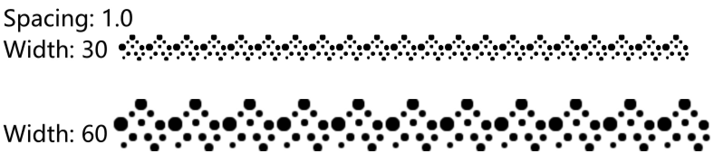

:::warning

This content is under construction and not peer-reviewed. Learn it under your own risk!

<details>
  <summary>I'm kidding!</summary>

  There’s no risk in learning something incorrectly.
  I'm 100% sure that all the theories are logically correct.

  The only risk is that I might change the terminology or math symbols to use.
  Hopefully this won't confuse you in the future.

</details>

:::

## Introduction to stamp patterns

### Fixed interval
In the [Stamp](../Basics/Stamp) section, I introduced stamp brush and methods to render it.
We assumed the interval between stamp is a fixed value along a stroke.

> While a user paints on a canvas, we render the texture onto the canvas **equidistantly** along the drawing trace.
> When the textures are close enough, they seem continuous and form a stroke.

But this "fixed interval" pattern is not always the case in practice and may cause a potential rendering problem.
Let's take a look at this problem.

Assume we draw two strokes on a canvas.
The first is a stamp stroke with dot footprint, and the second is a basic solid stroke, as the figure below shows.
I want to copy the first stroke's brush and apply the brush to the second stroke.


You may notice the resulting stroke has denser dots and appearance.
This is because the interval between stamps in the first stroke is equal to the radius of each dot.
In contrast, the interval in the resulting stroke is smaller than its radius.
So, the result stroke's dots are aligned more densely than those in the first stroke.

As we change the stroke radius, the interval between the dots has not been adjusted accordingly.
The change in interval leads to the change in appearance.
This is unintuitive since artists expect the concept of "brush" controls the stroke appearance.
Copying and pasting a brush imply the source and target stroke have the same appearance.

Expect for copying brush, the issue also happens when resizing a stroke.
For example, imagine a case that we export vector drawings from a paint program to a game engine.
When rendering the drawings,
the game engine may need to scale the strokes' position and radius to translate them from local space to world space.
Unluckily, a careless programmer like me forgets to scale the stamp interval accordingly.
In the worst case, the interval is larger than the length of strokes.
So, nothing shows the canvas and I would spend a whole day to debug it.

To avoid the issue, we rarely use a fixed length value as a brush parameter for artist to adjust.
Instead, we make the stamp interval be proportional to the stroke radius,
and use their ratio as the brush parameter.
Here, I call this value **interval ratio**, and denote it with the symbol $\eta$.
$$
\eta = \frac{Interval}{Radius}
$$
For a paint program on the market like Krita, you can definitely find this parameter in its brush editor.
The parameter might be half of the value as defined in our system, because the program uses width value rather than radius value.




The "spacing: 1.0" means the stamp interval is the stroke width, or 2x radius.
So the footprints connect to each other in a row, even though the stroke radius is changed.

To implement this feature with our GPU rendering method, I would set the interval ratio as a uniform in shader.
It is pretty straightforward as the pseudocode below shows.

```glsl
// Get the `interval_ratio` value instead of `interval` from CPU.
uniform float interval_ratio;
float interval = interval_ratio * radius; // The stroke without variable width has only one radius value.
// Everything else remains the same......
```

However, things are tricky when rendering variable width strokes.
We have varying radius value, so which radius value should be used to calculate the interval?
In a paint program like Krita, user-specified brush size in the figure above is a prefect choice.
But we cannot easily get a user-specified radius value except in a paint program.
There is a better solution, we let the stamp interval vary together with the stroke radius.

### Proportional interval

