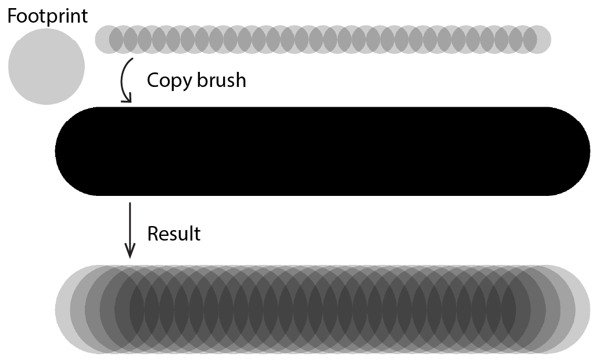

:::warning

This content is under construction and not peer-reviewed. Learn it under your own risk.

:::

## Introduce another stamp pattern

In the Stamp section, I introduced stamp brush and methods to render it.
We assumed the intervals between stamp positions are fixed and equal along a stroke.
But that "fixed interval" pattern is not always the case in practice and may cause a potential rendering problem.
Let's take a look at this problem.

Assume we draw two strokes on a canvas.
The first is a stamp stroke with dot footprint, and the second is a basic solid stroke, as the figure below shows.
I want to copy the first stroke's brush and apply the brush to the second stroke.

