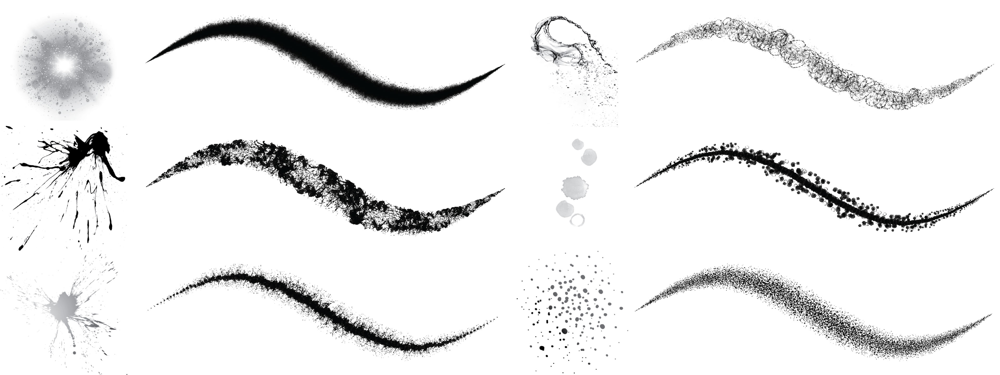

import {
  ArticulatedLine2D,
  airBrushUniforms,
  dotBrushUniforms,
  dotHalfBrushUniforms,
} from "../src/components/ArticulatedLine2D";

This tutorial series will teach you how to render brush strokes with the modern GPU graphics pipeline.
If you like this series, please star the **Anonymous** instead of bookmark this website since the domain might be changed.

## Table of Contents

- [Introduction](./introduction)
- Basics
  - [Problem Statement](./Basics/Basics)
  - [Vanilla](./Basics/Vanilla)
  - [Stamp](./Basics/Stamp)
- [Airbrush](./Airbrush)

Future Contents

**Stamp density and "ratio-distance"**

  

    <ArticulatedLine2D uniforms={dotBrushUniforms} />
    

      <em> Adjacent dots </em>
    

  

  

    <ArticulatedLine2D uniforms={dotHalfBrushUniforms} />
    

      <em> Adjacent with one dot interleaved </em>
    

  

 

You can see dots are adjacent to each other instead of equidistantly distributed.
The pattern is achieved by setting the intervals between dots proportional to their radii.
You will learn how to freely control stamp density along a stamp
stroke. Very important for a serious project.

**3D stroke**

Learn how to extend the algorithms to 3D space.

I'm integrating it into the Blender Grease Pencil:

